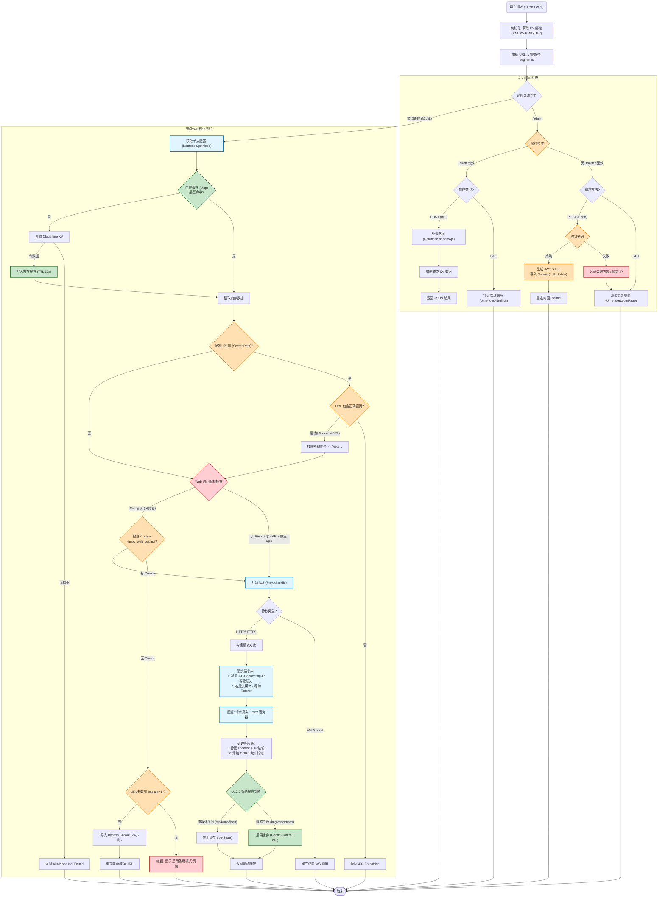

## CF-EMBY-PROXY-UI 最新版本：V17.6

## 描述

这是一个基于 Cloudflare Workers 开发的单文件worker.js Emby 代理系统，通过边缘计算实现多服务器节点的统一管理与流量分发。

项目利用 Cloudflare KV 数据库持久化存储节点配置，并针对流媒体播放和静态资源内置了智能缓存与 WebSocket 优化逻辑。

前端提供了一个支持高度个性化定制（如毛玻璃效果、背景图）的管理后台，用户无需复杂配置即可通过可视化界面完成节点的部署、导入导出及私密路径设置。

---

## 原理

**流量转发原理**：客户端通过代理链接发送请求到Worker指定访问EMBY源站，Worker 作为一个中间人，一方面修改请求头并发送请求到EMBY源站，一方面接受源站的数据以流式传输透传给客户端。HTTP(S)协议请求传输，WS协议保持心跳连接等

**IP隐藏原理**：借用Cloudflare 的边缘网络实现隐藏EMBY源站真实IP隐藏，起到隐藏和保护EMBY源站的作用。

---

## 需求前提

**访问EMBY源站直连差【EMBY源站在国外，线路不好】**  利用cloudflare加速访问

**多台服务器想统一入口【多台服务器需要EMBY反代】**，路由分流，URL路径分流。

**不想暴露EMBY源站的真实 IP**

**内网不需要**

**腐竹不需要**

**EMBY源站是国内机器/CN2，这类直连线路不需要**

---

## **须知前提**

**腐竹让不让反代**， 询问腐竹让不让反代？腐竹禁止国内IP访问，使用该项目可能会让你EMBY账号封禁

**客户端支不支持反代** ，客户端可以选择小幻,hills,vidhub,senplayer,forward,afusekt 【我测试的hills没有问题】

**滥用的话cloudflare可能会暂停账号功能或是封号** ，项目已设置 `Cache-Control: no-store` 并禁用了 Cloudflare 对流媒体文件的缓存，符合 Cloudflare 服务条款中关于“非 HTML 内容缓存”的规定。 但请注意：如果您的日均流量过大（如 TB 级别），仍可能因占用过多带宽被 Cloudflare 判定为滥用（Section 2.8）。**建议仅用于个人或家庭分享**。

**EMBY服禁用web问题**，17.3版本默认使用API访问并禁用WEB，备用方案是使用WEB端需要格外跳转，一天的授权时间仅限网页版

**反代的限制**，虽然该代码会向EMBY服务器暴露你的真实IP，但是emby日志可能全是CF的IP并非你的真实IP，这样可能会**导致连坐**，**播放限制**，**账号风险**，【无法从此项目代码上修改】
如果腐竹没有信任cf的ip就无法传达真实IP
默认情况下Emby不信任任何来源的IP发来的 X-Forwarded-For 头部【nginx反代也是如此】

**端口要求**，支持任意的EMBY服端口反代，当你使用反代链接你必须使用CF支持的端口，CF支持的加密端口有：443, 2053, 2083, 2087, 2096, 8443 

---

## 域名设置

#### 【可选】**DNS记录**

 - 添加一条**CNAME解析** 用作worker加速 [CM大佬教程](https://blog.cmliussss.com/p/BestWorkers/)

#### **SSL/TLS** 

---概述

- 选择**完全** 【不要选严格】

---边缘证书  

- 开启**始终使用 HTTPS**  
- **最低 TLS 版本**选择TLS1.2 
- 开启**随机加密**  
- 开启**TLS 1.3**  
- 开启**自动 HTTPS 重写**  

#### 速度

---设置

- 开启**站点推荐设置** 

--- Smart Shield

- 开启**Smart Shield** 

#### 缓存

---配置

- **浏览器缓存 TTL** 【一天或很久】

---Tiered Cache

- 开启**Tiered Cache** 

####  网络

- 开启**WebSockets** 

---

## **环境变量一览**

| **变量名**   | **必填** | **作用**                                                     | **示例**              |
| ------------ | -------- | ------------------------------------------------------------ | --------------------- |
| `ENI_KV`     | ✅        | **必须在后台绑定 KV Namespace**，代码读写数据的数据库。      | (选择绑定的 KV)       |
| `ADMIN_PASS` | ✅        | 后台管理界面的登录密码。                                     | `MySuperPass123`      |
| `JWT_SECRET` | ❌        | 用于加密 Cookie 的盐值。不填则默认等于 `ADMIN_PASS`。修改此项会导致所有已登录用户掉线。 | `ComplexRandomString` |

---

## 温馨提示：

**定期手动备份：利用面板自带的 Export (导出) 功能，每添加几个重要节点就导出一份 JSON 存到本地。 KV 数据库一旦丢失，意味着辛辛苦苦保存的内容都会丢失**

**使用强密码：鉴于脚本没有验证码机制，请确保 ADMIN_PASS 足够复杂，防止被暴力扫描工具撞库。**

---

##  部署指南 (Step-by-Step)

#### 第一步：创建 KV 命名空间

1. 登录 Cloudflare Dashboard。
2. 进入 **Workers & Pages** -> **KV**。
3. 点击 **Create a Namespace**。
4. 命名为 `EMBY_DATA` (或者任何你喜欢的名字)，点击 Add。

#### 第二步：创建 Worker

1. 进入 **Workers & Pages** -> **Overview** -> **Create Application**。
2. 点击 **Create Worker**，命名建议为 `emby-proxy`，点击 Deploy。
3. 点击 **Edit code**，将本项目提供的 `worker.js` 代码完整复制进去。
4. 保存并部署。

#### 第三步：绑定 KV 数据库 (关键)

1. 在 Worker 的设置页面，点击 **Settings** -> **Variables**。
2. 向下滚动到 **KV Namespace Bindings**。
3. 点击 **Add Binding**。
4. **Variable name** 填写：`ENI_KV` (**注意：必须完全一致**)。
5. **KV Namespace** 选择第一步创建的 `EMBY_DATA`。
6. 点击 **Save and Deploy**。

#### 第四步：设置密码

1. 还在 **Settings** -> **Variables** 页面。

2. 在 **Environment Variables** 区域点击 **Add Variable**。

3. **Variable name** 填写：`ADMIN_PASS`。**Value** 填写你的后台登录密码。

4. **Variable name** 填写  `JWT_SECRET`  **Value** 填写随机生成字符串。

5. 点击 **Encrypt** (加密存储)，然后 **Save and Deploy**。

---

   ## 📖 使用说明

#### 1. 进入管理后台

访问地址：`https://你的Worker域名/admin`

* 输入在环境变量中设置的密码登录。
* 如果连续输错 5 次，IP 将被锁定 15 分钟。

#### 2. 添加代理节点

在后台左侧面板输入：

* **代理名称**：例如 `HK` (仅限小写英文/数字)。
* **访问密钥** (可选)：例如 `123`。如果留空，则公开访问。
* **服务器地址**：Emby 源站地址，例如 `http://1.2.3.4:8096` (不要带结尾的 `/`)
* **TAG标签**(可选)

点击 **立即部署**。

#### 3. 客户端连接

* **公开节点**：`https://你的Worker域名/HK`

* **加密节点**：`https://你的Worker域名/HK/123`

  只需要把原来的**EMBY源站链接**换成**节点链接**使用

  当客户端端口可以选填时，不用填写端口【默认443端口】

  **端口要求**：443, 2053, 2083, 2087, 2096, 8443 

#### 4. 数据备份

* 点击列表右上角的 **导出** 按钮，可下载 `json` 备份文件。
* 点击 **导入** 可恢复数据或批量添加节点（支持热更新，缓存立即刷新）。

---

## **速度**

**Cloudflare 线路质量**：用户本地网络连接到 Cloudflare 边缘节点的优劣（国内移动/联通/电信直连 CF 的效果差异很大）。一般情况下联通延迟最高 

**CF 与 EMBY源站的对等连接**：Cloudflare 美国/香港节点与 Emby 源站服务器链接 

**EMBY源站上行带宽** 无解 

**转码能力**：如果触发转码，取决于服务器 CPU/GPU 性能。

---

## **缓存**

**自动区分**：媒体文件（不缓存）和静态资源（图片、JS、CSS 字幕等缓存）TTL 设为 1 天

Workers Cache API 缓存 KV 读取结果，减少KV读写次数

**三级缓存**：结合内存级 NodeCache、Cloudflare 默认 caches 缓存以及底层的 KV 存储。内存层**拦截了 99% 以上的重复请求**，边缘缓存 (`caches`) 充当了“中间站”，它不随实例销毁而消失，能让新启动的实例快速找回配置。**KV 存储**则作为“最后的防线”，确保即使边缘缓存被清空，数据依然能从持久化磁盘中恢复。

Cloudflare 边缘缓存的强制策略30天

代码会将 KV 中的节点配置缓存到 Cloudflare 的边缘计算缓存中（`caches.default`），有效期 60 秒。

---

## **KV空间作用**

**储存代理信息**：（名称、目标 URL、Secret）

**记录登录失败的 IP 和次数**：某IP 连续输错 5 次密码，会被锁定 15 分钟

**保存自定义的 UI 界面设置**：个性化配置，会以 `sys:theme` 为键保存在 KV 空间中。

---

## **常见403 Access Denied问题**

1. **路径访问错误**：后台登录 /admin ，直接复制连接访问就好。EMBY自定义路径无解只能修改代码。
2. **缺少 Secret (密钥)**：你给节点设置了 Secret（例如 `123`），但访问时没有带上。
   - *正确访问方式：`domain.com/HK/123`*
   - *错误访问方式：`domain.com/HK`*
3. **KV 未绑定**：如果没有正确绑定 `ENI_KV`，脚本读取不到节点信息，也会导致找不到节点而拒绝访问（或报 500 错误）。

---

# 代码一览概述

---

## 核心功能模块

### 1. 动态代理与请求分发 (`Proxy` 模块)

* **优先使用API访问，使用API访问时禁用WEB端**，存在WEB备用模式，保存一天cookie
* **路径重定向移除**，无限重定向修复
* **WebSocket 支持**：支持 Emby 的实时通信（如播放控制、通知），通过 `WebSocketPair` 实现。
* **智能缓存策略**：
* **静态资源**：针对图片、JS、CSS 等静态文件，开启 `cacheEverything` 并设置 24 小时缓存。
* **流媒体内容**：针对视频格式（`.mkv`, `.mp4` 等），**禁用缓存**并移除 `Referer` 请求头，防止被后端防盗链拦截。

* **Header 伪装**：自动删除 Cloudflare 特有的请求头（如 `cf-ray`），并设置 `X-Real-IP` 和 `X-Forwarded-For`，确保后端服务器能获取到客户端的真实 IP。
* **Location 重写**：如果后端返回 302 重定向，脚本会修改 `Location` 响应头，确保重定向后的 URL 依然保持在代理路径下。

### 2. 身份验证与安全 (`Auth` 模块)

* **JWT 鉴权**：管理面板使用 **JWT (JSON Web Token)** 进行状态保持，默认有效期为 7 天。
* **暴力破解防御**：
* 使用 KV 数据库记录登录失败次数。
* 超过 5 次失败后，锁定 IP 15 分钟（`LoginLockDuration`）。

* **私密路径 (Secret Path)**：支持为特定节点设置隐藏路径（例如 `/node/secret_key/path`），只有知道密钥的人才能访问代理。

### 3. 数据持久化与性能 (`Database` 模块)

* **多级缓存架构**：
* **一级缓存**：内存级 `Map` (`NodeCache`)，极速响应。
* **二级缓存**：Cloudflare 默认的 `caches.default`，用于跨实例同步配置。
* **三级存储**：Cloudflare KV，作为最终的持久化存储。

* **KV 自动兼容**：代码会自动检测环境变量名（`ENI_KV`, `KV`, `EMBY_KV` 等），提高部署兼容性。

### 4. 管理面板 UI (`UI` 模块)

* **现代化后台**：提供响应式设计，支持 PC 和手机访问。
* **批量操作**：支持节点的批量删除、批量设置标签（Tag）。
* **导入/导出**：支持 JSON 格式导出节点配置，方便迁移。
* **节点可视化管理**：可以一键显示/隐藏目标地址（Target）和代理地址（Proxy）。
* **个性化定制**：
* **主题模式**：支持深色/浅色切换，并能根据中国时间 (UTC+8) 自动切换昼夜模式。
* **视觉效果**：支持自定义背景图、毛玻璃效果（Blur）、主题色（Accent Color）以及自定义 CSS。

---

## 代码流程图 (请求处理逻辑)

---

## 技术亮点与细节审查

* **时区感知**：`GLOBALS.isDaytimeCN()` 硬编码了 `+8` 小时偏移，专门针对中国用户优化了昼夜主题切换逻辑。
* **流媒体优化**：在 `Proxy.handle` 中，通过正则表达式 `GLOBALS.Regex.Streaming` 精准识别流媒体文件，并强制设置 `Cache-Control: no-store`，避免流媒体大文件占用 Cloudflare 缓存空间导致的问题。
* **代码鲁棒性**：在 V17.2 版本中修复了 `escapeHtml` 缺失导致的渲染报错，并增强了对 KV 变量命名的兼容性。

## 安全建议

1. **JWT_SECRET**：确保在环境变量中设置了高强度的 `JWT_SECRET`。如果不设置，系统会退而求其次使用 `ADMIN_PASS` 作为密钥，这会降低安全性。
2. **KV 绑定**：部署时必须手动绑定一个 KV 命名空间到 Worker，否则管理面板将无法保存任何节点信息。

---
